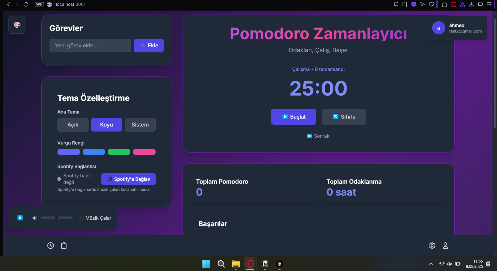

# Pomodoro Plus - Spotify Entegrasyonu

<div align="center">
  
</div>

Modern ve kapsamlı Pomodoro zamanlayıcı uygulaması ile Spotify entegrasyonu.

## 🚀 Özellikler

- **Pomodoro Timer**: 25 dakikalık çalışma, 5 dakikalık mola
- **Todo Listesi**: Görev yönetimi
- **Spotify Entegrasyonu**: Gerçek müzik çalma
- **Tema Desteği**: Açık/koyu tema
- **Kullanıcı Sistemi**: NextAuth ile kimlik doğrulama

## 🎵 Spotify API Kurulumu

### 1. Spotify Developer Dashboard'a Giriş
1. [Spotify Developer Dashboard](https://developer.spotify.com/dashboard)'a gidin
2. Spotify hesabınızla giriş yapın
3. "Create App" butonuna tıklayın

### 2. Uygulama Oluşturma
- **App name**: Pomodoro Plus
- **App description**: Pomodoro timer with Spotify integration
- **Website**: http://localhost:3000
- **Redirect URI**: http://localhost:3000/api/auth/callback/spotify

### 3. Environment Değişkenleri
Proje kök dizininde `.env.local` dosyası oluşturun:

```env
# NextAuth
NEXTAUTH_SECRET=your-secret-key-here
NEXTAUTH_URL=http://localhost:3000

# Spotify API
SPOTIFY_CLIENT_ID=your-spotify-client-id
SPOTIFY_CLIENT_SECRET=your-spotify-client-secret
SPOTIFY_REDIRECT_URI=http://localhost:3000/api/auth/callback/spotify
```

### 4. Spotify API Scopes
Uygulamanız şu izinleri kullanır:
- `user-read-private`: Kullanıcı profil bilgileri
- `user-read-email`: E-posta adresi
- `user-read-playback-state`: Çalma durumu
- `user-modify-playback-state`: Müzik kontrolü
- `user-read-currently-playing`: Şu an çalan şarkı
- `streaming`: Müzik çalma
- `playlist-read-private`: Özel playlist'ler
- `playlist-read-collaborative`: İşbirlikçi playlist'ler
- `user-library-read`: Kullanıcı kütüphanesi
- `user-top-read`: En çok dinlenen şarkılar

## 🛠 Kurulum

```bash
# Bağımlılıkları yükle
npm install

# Development server'ı başlat
npm run dev
```

## 📱 Kullanım

1. **Ana Sayfa**: http://localhost:3000
2. **Spotify Bağlantısı**: Sol alt köşedeki müzik çalar ile Spotify'a bağlanın
3. **Pomodoro Timer**: 25 dakikalık çalışma süreleri
4. **Todo Listesi**: Görevlerinizi yönetin
5. **Tema Değiştirme**: Açık/koyu tema seçenekleri

## 🎯 Spotify Özellikleri

- **Gerçek Müzik Çalma**: Spotify Premium ile
- **Playlist Yönetimi**: Kullanıcının playlist'lerini görüntüleme
- **Müzik Arama**: Spotify kütüphanesinde arama
- **Ses Kontrolü**: Ses seviyesi ayarlama
- **Şarkı Bilgileri**: Şarkı adı, sanatçı, albüm bilgileri

## 🔧 Teknolojiler

- **Frontend**: Next.js 14, React 18, TypeScript
- **Styling**: Tailwind CSS
- **Authentication**: NextAuth.js
- **Music API**: Spotify Web API
- **State Management**: Zustand
- **Animations**: Framer Motion

## 📚 API Referansı

Spotify Web API dokümantasyonu için: [Spotify Web API](https://developer.spotify.com/documentation/web-api)

## 🤝 Katkıda Bulunma

1. Fork yapın
2. Feature branch oluşturun (`git checkout -b feature/amazing-feature`)
3. Commit yapın (`git commit -m 'Add amazing feature'`)
4. Push yapın (`git push origin feature/amazing-feature`)
5. Pull Request oluşturun

## 📄 Lisans

Bu proje MIT lisansı altında lisanslanmıştır. 